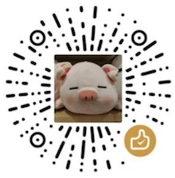

## Getting Started

---

- ### ToggleJsonCase
1. Select raw text
```yml
Transfer-Encoding: chunked
Vary: Accept-Encoding

X-Runtime: 0.069586
```

2. Press **cmd shift p** and enter **toggleJsonCase**

    The text is replaced with:
```python
"Transfer-Encoding": "chunked",
"Vary": "Accept-Encoding",

"X-Runtime": "0.069586",
```

3. Again press **cmd shift p** and enter **toggleJsonCase**

    The text is replaced with:
```python
Transfer-Encoding = "chunked"
Vary = "Accept-Encoding"

X-Runtime = "0.069586"
```

---

- ### ToggleUpperCase
1. Select raw text
```yml
Transfer-Encoding: chunked
Vary: Accept-Encoding

X-Runtime: 0.069586
```

2. Press **cmd shift p** and enter **toggleUpperCase**

    The text is replaced with:
```yml
TRANSFER-ENCODING: CHUNKED
VARY: ACCEPT-ENCODING

X-RUNTIME: 0.069586
```
3. Again press **cmd shift p** and enter **toggleUpperCase**

    The text is replaced with:
```yml
transfer-encoding: chunked
vary: accept-encoding

x-runtime: 0.069586
```
---

- ### ToggleCamelCase
1. Select raw text
```python
Transfer-Encoding = "chunked"
Vary = "Accept-Encoding"

X-Runtime = "0.069586"
```

2. Press **cmd shift p** and enter **toggleCamelCase**

    The text is replaced with:
```python
TransferEncoding = "chunked"
Vary = "Accept-Encoding"

XRuntime = "0.069586"
```

3. Again press **cmd shift p** and enter **toggleCamelCase**

    The text is replaced with:
```python
transfer_encoding = "chunked"
vary = "Accept-Encoding"

xruntime = "0.069586"
```
---

### Donate ☕️

Thank you most sincerely



Github: https://github.com/tuweifeng/vscode-extensions-txtrans